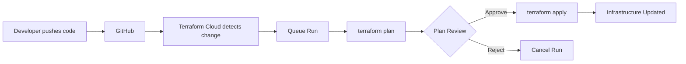

# Terraform Cloud Setup Guide

This guide walks you through setting up Terraform Cloud for managing your GCP infrastructure, including integration with GitHub and GCP authentication.

## Table of Contents

1. [Prerequisites](#prerequisites)
2. [Terraform Cloud Setup](#terraform-cloud-setup)
3. [GitHub Integration](#github-integration)
4. [GCP Service Account Setup](#gcp-service-account-setup)
5. [Workspace Configuration](#workspace-configuration)
6. [Running Terraform](#running-terraform)
7. [Troubleshooting](#troubleshooting)

---

## Prerequisites

### Required Accounts

- ✅ **Terraform Cloud Account**: Sign up at [app.terraform.io](https://app.terraform.io)
- ✅ **GCP Project**: Active GCP project with billing enabled
- ✅ **GitHub Account**: Repository with your Terraform code

### Required Tools

- Terraform CLI (v1.0+)
- gcloud CLI
- git

---

## Terraform Cloud Setup

### Step 1: Create Organization

1. **Log in to Terraform Cloud**: [app.terraform.io](https://app.terraform.io)

2. **Create Organization**:
   - Click **"Create Organization"**
   - Organization Name: `your-organization-name` (e.g., `acme-corp`)
   - Email: Your admin email
   - Click **"Create organization"**

### Step 2: Create Workspace

1. **Navigate to Workspaces**:
   - Click **"New Workspace"**

2. **Choose Workflow**:
   - Select **"Version control workflow"** (recommended)
   - Or **"CLI-driven workflow"** for local execution

3. **Configure Workspace**:
   - **Workspace Name**: `cloud-app-gcp-prd`
   - **Working Directory**: `infrastructure/envs/prd`
   - **Terraform Version**: Latest or `~> 1.5`
   - Click **"Create workspace"**

---

## GitHub Integration

### Step 3: Connect GitHub Repository

1. **In Terraform Cloud Workspace**:
   - Go to **Settings** → **Version Control**
   - Click **"Connect to version control"**

2. **Choose GitHub**:
   - Select **"GitHub.com"** or **"GitHub Enterprise"**
   - Click **"Connect to GitHub"**
   - Authorize Terraform Cloud

3. **Select Repository**:
   - Choose your repository: `your-org/cloud-app-gcp`
   - Click **"Choose Repository"**

4. **Configure VCS Settings**:
   - **VCS Branch**: `main` or `master`
   - **Working Directory**: `infrastructure/envs/prd`
   - **Automatic Run Triggering**: Enable
   - **Trigger Patterns** (optional):
     ```
     infrastructure/envs/prd/**
     infrastructure/modules/gcp/**
     ```
   - Click **"Update VCS settings"**

### Step 4: Configure Automatic Runs

1. **Settings** → **Run Triggers**:
   - **Auto-apply**: ❌ Disabled (manual approval recommended for production)
   - **Auto-queue runs**: ✅ Enabled
   - **Speculative Plans**: ✅ Enabled (for PRs)

---

## GCP Service Account Setup

### Step 5: Create GCP Service Account

```bash
# Set your GCP project ID
export PROJECT_ID="your-gcp-project-id"

# Authenticate with GCP
gcloud auth login
gcloud config set project ${PROJECT_ID}

# Create service account for Terraform
gcloud iam service-accounts create terraform-cloud-sa \
  --display-name="Terraform Cloud Service Account" \
  --description="Service account for Terraform Cloud to manage GCP resources"

# Get service account email
export SA_EMAIL="terraform-cloud-sa@${PROJECT_ID}.iam.gserviceaccount.com"

echo "Service Account Email: ${SA_EMAIL}"
```

### Step 6: Grant Required Permissions

```bash
# Grant necessary roles to the service account
gcloud projects add-iam-policy-binding ${PROJECT_ID} \
  --member="serviceAccount:${SA_EMAIL}" \
  --role="roles/editor"

gcloud projects add-iam-policy-binding ${PROJECT_ID} \
  --member="serviceAccount:${SA_EMAIL}" \
  --role="roles/compute.networkAdmin"

gcloud projects add-iam-policy-binding ${PROJECT_ID} \
  --member="serviceAccount:${SA_EMAIL}" \
  --role="roles/container.admin"

gcloud projects add-iam-policy-binding ${PROJECT_ID} \
  --member="serviceAccount:${SA_EMAIL}" \
  --role="roles/cloudsql.admin"

gcloud projects add-iam-policy-binding ${PROJECT_ID} \
  --member="serviceAccount:${SA_EMAIL}" \
  --role="roles/iam.serviceAccountAdmin"

gcloud projects add-iam-policy-binding ${PROJECT_ID} \
  --member="serviceAccount:${SA_EMAIL}" \
  --role="roles/iam.serviceAccountKeyAdmin"

gcloud projects add-iam-policy-binding ${PROJECT_ID} \
  --member="serviceAccount:${SA_EMAIL}" \
  --role="roles/resourcemanager.projectIamAdmin"

gcloud projects add-iam-policy-binding ${PROJECT_ID} \
  --member="serviceAccount:${SA_EMAIL}" \
  --role="roles/servicenetworking.networksAdmin"
```

### Step 7: Create and Download Service Account Key

```bash
# Create service account key
gcloud iam service-accounts keys create ~/terraform-cloud-sa-key.json \
  --iam-account=${SA_EMAIL}

echo "Service account key created: ~/terraform-cloud-sa-key.json"
echo "⚠️  Keep this file secure and never commit it to version control!"
```

### Step 8: Enable Required GCP APIs

```bash
# Enable required APIs
gcloud services enable compute.googleapis.com
gcloud services enable container.googleapis.com
gcloud services enable sqladmin.googleapis.com
gcloud services enable servicenetworking.googleapis.com
gcloud services enable cloudresourcemanager.googleapis.com
gcloud services enable iam.googleapis.com
gcloud services enable logging.googleapis.com
gcloud services enable monitoring.googleapis.com

echo "✅ All required APIs enabled"
```

---

## Workspace Configuration

### Step 9: Configure Terraform Cloud Variables

#### Environment Variables (GCP Authentication)

1. **In Terraform Cloud Workspace**:
   - Go to **Variables** tab
   - Under **Environment Variables**, click **"Add variable"**

2. **Add GCP Credentials** (choose ONE method):

   **Method A: Using Service Account Key (Recommended)**
   
   | Key | Value | Sensitive | Description |
   |-----|-------|-----------|-------------|
   | `GOOGLE_CREDENTIALS` | Contents of `terraform-cloud-sa-key.json` | ✅ Yes | Full JSON key file content |
   | `GOOGLE_PROJECT` | `your-gcp-project-id` | ❌ No | GCP Project ID |
   | `GOOGLE_REGION` | `us-central1` | ❌ No | Default region |

   **Method B: Using Workload Identity Federation** (More secure, recommended for production)
   
   | Key | Value | Sensitive | Description |
   |-----|-------|-----------|-------------|
   | `TFC_GCP_PROVIDER_AUTH` | `true` | ❌ No | Enable dynamic credentials |
   | `TFC_GCP_PROJECT_NUMBER` | `your-project-number` | ❌ No | GCP Project number |
   | `TFC_GCP_WORKLOAD_PROVIDER_NAME` | `projects/PROJECT_NUMBER/locations/global/workloadIdentityPools/POOL_ID/providers/PROVIDER_ID` | ❌ No | Workload Identity provider |
   | `TFC_GCP_SERVICE_ACCOUNT_EMAIL` | `terraform-cloud-sa@PROJECT_ID.iam.gserviceaccount.com` | ❌ No | Service account email |

#### Terraform Variables (Infrastructure Configuration)

1. **Add Terraform Variables**:
   - Under **Terraform Variables**, click **"Add variable"**

2. **Required Variables**:

   | Variable Name | Value | Sensitive | HCL | Description |
   |---------------|-------|-----------|-----|-------------|
   | `project_id` | `your-gcp-project-id` | ❌ No | ❌ No | GCP Project ID |
   | `region` | `us-central1` | ❌ No | ❌ No | Primary region |
   | `master_authorized_networks` | See example below | ❌ No | ✅ Yes | Authorized networks for GKE |

   **Example for `master_authorized_networks` (HCL format)**:
   ```hcl
   [
     {
       cidr_block   = "203.0.113.0/24"
       display_name = "Office Network"
     },
     {
       cidr_block   = "198.51.100.0/24"
       display_name = "VPN Network"
     }
   ]
   ```

3. **Optional Variables** (if overriding defaults):
   - `gke_node_pool_machine_type`
   - `cloudsql_tier`
   - `allowed_ssh_cidrs`
   - Any other variables from `terraform.tfvars`

### Step 10: Update provider.tf with Your Organization

**Edit `infrastructure/envs/prd/provider.tf`**:

```hcl
terraform {
  cloud {
    organization = "your-organization-name"  # ← Replace with your TFC org name

    workspaces {
      name = "cloud-app-gcp-prd"
    }
  }
}
```

---

## Running Terraform

### Option 1: Automatic Runs (via GitHub)

1. **Make changes to your Terraform code**
2. **Commit and push to GitHub**:
   ```bash
   git add .
   git commit -m "Update infrastructure configuration"
   git push origin main
   ```
3. **Terraform Cloud will automatically**:
   - Queue a new run
   - Execute `terraform plan`
   - Wait for manual approval
   - Apply changes (after approval)

### Option 2: Manual Run (via Terraform Cloud UI)

1. **Go to Workspace** → **"Actions"** → **"Start new run"**
2. **Add reason**: "Manual production deployment"
3. **Review plan**
4. **Approve and apply**

### Option 3: CLI-Driven Workflow

1. **Login to Terraform Cloud**:
   ```bash
   cd infrastructure/envs/prd
   terraform login
   ```

2. **Initialize Terraform**:
   ```bash
   terraform init
   ```

3. **Run Plan**:
   ```bash
   terraform plan
   ```

4. **Apply Changes**:
   ```bash
   terraform apply
   ```

---

## Workflow: VCS-Driven (Recommended)



### Pull Request Workflow

1. **Create feature branch**:
   ```bash
   git checkout -b feature/update-gke-config
   ```

2. **Make changes and push**:
   ```bash
   git add .
   git commit -m "Update GKE node pool configuration"
   git push origin feature/update-gke-config
   ```

3. **Create Pull Request**:
   - Terraform Cloud will automatically run **speculative plan**
   - Review plan in PR comments

4. **Merge PR**:
   - Terraform Cloud will queue **apply run**
   - Approve to apply changes

---

## Security Best Practices

### 1. Service Account Security

✅ **Use least privilege**: Grant only necessary roles  
✅ **Rotate keys regularly**: Create new keys every 90 days  
✅ **Use Workload Identity Federation**: Eliminate static keys (recommended)  
✅ **Never commit keys**: Add `*.json` to `.gitignore`  

### 2. Workspace Security

✅ **Enable MFA**: For all Terraform Cloud users  
✅ **Restrict access**: Use teams and role-based access control  
✅ **Sensitive variables**: Mark credentials as sensitive  
✅ **State encryption**: Enabled by default in Terraform Cloud  

### 3. Run Approvals

✅ **Manual approval**: Required for production applies  
✅ **Review plans**: Always review before approving  
✅ **Run notifications**: Configure Slack/email notifications  

---

## Notifications Setup

### Configure Slack Notifications

1. **Settings** → **Notifications**
2. **Create new notification**:
   - Name: "Production Run Notifications"
   - Destination: Slack
   - Webhook URL: Your Slack webhook
   - Triggers:
     - ✅ Run requires confirmation
     - ✅ Run errored
     - ✅ Run completed

---

## Troubleshooting

### Issue: "Error: Failed to get existing workspaces"

**Solution**:
```bash
terraform logout
terraform login
terraform init -reconfigure
```

### Issue: "Error: google: could not find default credentials"

**Solution**: Verify `GOOGLE_CREDENTIALS` environment variable in workspace settings

### Issue: "403 Forbidden" errors from GCP API

**Solution**: Check service account permissions:
```bash
gcloud projects get-iam-policy ${PROJECT_ID} \
  --flatten="bindings[].members" \
  --filter="bindings.members:serviceAccount:${SA_EMAIL}"
```

### Issue: API not enabled errors

**Solution**: Enable missing APIs:
```bash
gcloud services enable SERVICE_NAME.googleapis.com
```

