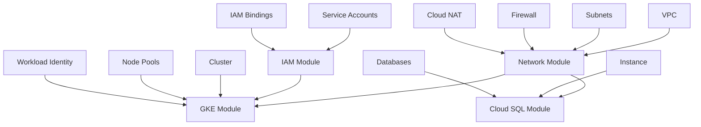

# GCP Terraform Modules

This directory contains reusable Terraform modules for provisioning and managing Google Cloud Platform (GCP) infrastructure.

## Module Overview

### 1. Network Module (`network/`)

Manages VPC networking infrastructure including:
- VPC networks with custom routing
- Subnets with secondary IP ranges for GKE
- Firewall rules for security policies
- Cloud NAT for private instance internet access
- Private Service Connection for managed services

**[View Network Module Documentation](./network/README.md)**

### 2. GKE Module (`gke/`)

Manages Google Kubernetes Engine resources:
- Regional or zonal GKE clusters
- Node pools with autoscaling
- Workload Identity configuration
- Private cluster setup
- Security features (shielded nodes, binary authorization)

**[View GKE Module Documentation](./gke/README.md)**

### 3. Cloud SQL Module (`cloudsql/`)

Manages Cloud SQL PostgreSQL instances:
- PostgreSQL database instances
- Private networking configuration
- Automated backups and point-in-time recovery
- Database and user management
- High availability setup

**[View Cloud SQL Module Documentation](./cloudsql/README.md)**

### 4. IAM Module (`iam/`)

Manages Identity and Access Management:
- Service account creation and management
- Project-level IAM bindings
- Service account impersonation
- Custom IAM policies with conditions
- GKE node service account configuration

**[View IAM Module Documentation](./iam/README.md)**

## Module Structure

Each module follows a consistent structure:

```
module-name/
├── *.tf                       # Resource-specific Terraform files
├── variables.tf                # Input variable definitions
├── outputs.tf                  # Output value definitions
└── README.md                   # Module documentation
```

### File Organization Principles

1. **Separation of Concerns**: Each resource category has its own `.tf` file
2. **Single Responsibility**: Files focus on a specific resource type
3. **Reusability**: Modules are designed to be called from different environments
4. **Documentation**: Comprehensive README files with examples

## Complete Infrastructure Example

Here's an example of how to use all modules together:

```hcl
# terraform.tfvars
project_id = "my-gcp-project"
region     = "us-central1"
environment = "production"

# main.tf
module "network" {
  source = "./modules/gcp/network"

  project_id  = var.project_id
  vpc_name    = "${var.environment}-vpc"
  
  subnets = [
    {
      name              = "gke-subnet"
      ip_cidr_range     = "10.0.0.0/24"
      region            = var.region
      secondary_ip_ranges = [
        {
          range_name    = "pods"
          ip_cidr_range = "10.1.0.0/16"
        },
        {
          range_name    = "services"
          ip_cidr_range = "10.2.0.0/16"
        }
      ]
    }
  ]

  cloud_nat_config = {
    enabled = true
    region  = var.region
  }
}

module "iam" {
  source = "./modules/gcp/iam"

  project_id = var.project_id

  service_accounts = [
    {
      account_id   = "gke-node-sa"
      display_name = "GKE Node Pool Service Account"
    }
  ]

  create_gke_node_service_account = true
  gke_node_service_account_key    = "gke-node-sa"
}

module "gke" {
  source = "./modules/gcp/gke"

  project_id    = var.project_id
  cluster_name  = "${var.environment}-gke"
  region        = var.region
  network       = module.network.vpc_self_link
  subnetwork    = module.network.subnet_self_links["gke-subnet"]

  pods_secondary_range_name     = "pods"
  services_secondary_range_name = "services"

  node_pools = [
    {
      name         = "default-pool"
      machine_type = "e2-medium"
      autoscaling = {
        min_node_count = 1
        max_node_count = 5
      }
      service_account = module.iam.service_account_emails["gke-node-sa"]
    }
  ]

  depends_on = [module.network, module.iam]
}

module "cloudsql" {
  source = "./modules/gcp/cloudsql"

  project_id      = var.project_id
  instance_name   = "${var.environment}-postgres"
  region          = var.region
  private_network = module.network.vpc_self_link
  
  databases = [
    {
      name = "myapp"
    }
  ]

  create_default_user = true

  private_vpc_connection = module.network.private_vpc_connection
  depends_on            = [module.network]
}
```

## Dependency Graph




```
cloud-app-gcp/infrastructure/
├── modules/gcp/             
│   ├── network/
│   ├── gke/
│   ├── cloudsql/
│   └── iam/
├── environments/           
│   ├── dev/
│   │   ├── main.tf
│   │   ├── variables.tf
│   │   └── terraform.tfvars
│   ├── staging/
│   └── prod/
└── shared/                  
    ├── backend.tf
    └── provider.tf
```

## Best Practices

### Security
- Use private clusters and private IP for databases
- Enable Workload Identity for GKE
- Implement least privilege IAM policies
- Enable deletion protection for critical resources

### Networking
- Use private Google access for subnets
- Implement network policies in GKE
- Use Cloud NAT for outbound internet access
- Enable VPC flow logs for monitoring

### High Availability
- Use regional GKE clusters
- Deploy Cloud SQL with REGIONAL availability
- Configure backup and recovery policies
- Use multiple node pools for workload isolation

### Cost Optimization
- Use autoscaling for GKE node pools
- Enable disk autoresize for Cloud SQL
- Use preemptible/spot instances for non-critical workloads
- Right-size machine types based on workload

## Provider Requirements

```hcl
terraform {
  required_version = ">= 1.0"
  
  required_providers {
    google = {
      source  = "hashicorp/google"
      version = ">= 4.0"
    }
    random = {
      source  = "hashicorp/random"
      version = ">= 3.0"
    }
  }
}
```

## Support and Contribution

For questions or issues:
1. Check module-specific README files
2. Review the complete infrastructure example above
3. Verify variable types and required inputs
4. Ensure proper module dependencies

