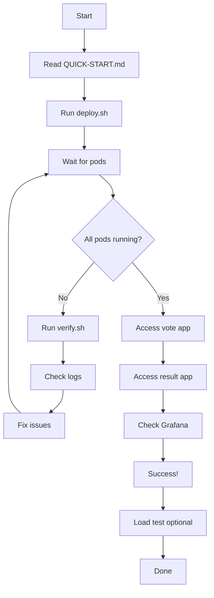

# Voting App - Local Test Cluster Deployment
## Complete Documentation Index

---

## 🚀 Getting Started

### For Quick Deployment (Recommended)
➡️ **[QUICK-START.md](QUICK-START.md)** - 30-second deployment guide
- One-command deployment
- Access URLs
- Port forwarding options
- Quick troubleshooting

### For Detailed Understanding
➡️ **[README.md](README.md)** - Complete documentation
- Architecture overview
- Step-by-step deployment
- Observability setup
- Comprehensive troubleshooting
- Resource requirements

---

## 📚 Reference Documentation

### Changes & Comparison
➡️ **[CHANGES.md](CHANGES.md)** - Production vs Test differences
- Detailed architecture changes
- Database configuration changes
- Resource optimization details
- Networking changes
- Line-by-line manifest comparisons

### Validation & Checklist
➡️ **[MANIFEST-CHECKLIST.md](MANIFEST-CHECKLIST.md)** - Verification guide
- Complete task checklist
- Manifest inventory
- Component mapping
- Resource summary
- Pre/post-deployment validation
- Testing scenarios

---

## 🛠️ Deployment Files

### Application Manifests

1. **[namespace.yaml](namespace.yaml)**
   - Creates `voting-app` namespace
   - Creates `observability` namespace

2. **[postgres-deployment.yaml](postgres-deployment.yaml)**
   - PostgreSQL 15 database
   - ConfigMap with credentials
   - 1Gi PVC
   - Service (ClusterIP)

3. **[redis-deployment.yaml](redis-deployment.yaml)**
   - Redis 7 cache
   - ConfigMap with settings
   - Service (ClusterIP)

4. **[vote-deployment.yaml](vote-deployment.yaml)**
   - Python Flask vote app
   - ConfigMap with options
   - Service (NodePort 31000)

5. **[result-deployment.yaml](result-deployment.yaml)**
   - Node.js result app
   - ConfigMap with DB connection
   - Service (NodePort 31001)

6. **[worker-deployment.yaml](worker-deployment.yaml)**
   - .NET worker app
   - ConfigMap with connections
   - No external service

### Observability Manifests

7. **[observability/prometheus-deployment.yaml](observability/prometheus-deployment.yaml)**
   - Prometheus metrics server
   - ConfigMap with scrape configs
   - 2Gi PVC
   - ServiceAccount + RBAC
   - Service (NodePort 32090)

8. **[observability/grafana-deployment.yaml](observability/grafana-deployment.yaml)**
   - Grafana visualization
   - ConfigMap with datasources
   - 1Gi PVC
   - Service (NodePort 32300)

9. **[observability/loki-deployment.yaml](observability/loki-deployment.yaml)**
   - Loki log aggregation
   - ConfigMap with settings
   - 2Gi PVC
   - Service (ClusterIP)

10. **[observability/promtail-deployment.yaml](observability/promtail-deployment.yaml)**
    - Promtail log collector
    - ConfigMap with pipeline
    - DaemonSet deployment
    - ServiceAccount + RBAC

### Automation Scripts

11. **[deploy.sh](deploy.sh)** - Automated deployment
    - Creates namespaces
    - Deploys in correct order
    - Waits for readiness
    - Shows access URLs

12. **[cleanup.sh](cleanup.sh)** - Cleanup automation
    - Removes all resources
    - Deletes namespaces
    - Verifies cleanup

13. **[verify.sh](verify.sh)** - Deployment verification
    - Checks pod status
    - Validates connectivity
    - Shows resource usage
    - Tests health endpoints

### Configuration Files

14. **[kustomization.yaml](kustomization.yaml)**
    - Kustomize configuration
    - Common labels and annotations
    - Resource list

---

## 📊 Component Overview

### Application Architecture

```
┌──────────────────────────────────────────┐
│        Voting App Namespace              │
├──────────────────────────────────────────┤
│                                          │
│  Vote (31000) ──▶ Redis ──▶ Worker       │
│                           │              │
│  Result (31001) ───────▶ PostgreSQL    │
│                                          │
└──────────────────────────────────────────┘

┌──────────────────────────────────────────┐
│     Observability Namespace            │
├──────────────────────────────────────────┤
│                                          │
│  Prometheus (32090) ──▶ Grafana (32300)│
│       ▲                      ▲          │
│       │                      │          │
│   Scrapes                  Loki          │
│    Apps                     ▲            │
│                             │            │
│                         Promtail         │
│                        (DaemonSet)       │
│                                          │
└──────────────────────────────────────────┘
```

---

## 🔗 Quick Links

### Access Points
- **Vote App**: `http://<NODE_IP>:31000`
- **Result App**: `http://<NODE_IP>:31001`
- **Prometheus**: `http://<NODE_IP>:32090`
- **Grafana**: `http://<NODE_IP>:32300` (admin/admin)

### Common Commands
```bash
# Deploy everything
./deploy.sh

# Verify deployment
./verify.sh

# Clean up
./cleanup.sh

# Get node IP
kubectl get nodes -o wide

# Check pods
kubectl get pods -n voting-app
kubectl get pods -n observability

# Port forward (KillerKoda)
kubectl port-forward -n voting-app svc/vote 8080:80
kubectl port-forward -n observability svc/grafana 3000:3000
```

---

## 📊 Resource Requirements

### Minimum Cluster Specs
- **Nodes**: 1
- **RAM**: 4GB
- **CPU**: 2 cores
- **Storage**: 10GB

### Expected Usage
- **Memory (Request)**: ~1.1 GB
- **Memory (Limit)**: ~2.3 GB
- **CPU (Request)**: ~0.55 cores
- **CPU (Limit)**: ~2.5 cores
- **Storage**: ~6 GB

---

## ⚙️ Key Differences from Production

| Feature | Production | Test Cluster |
|---------|-----------|-------------|
| Database | Cloud SQL + Proxy | PostgreSQL in-cluster |
| Networking | Gateway API | NodePort |
| Deployment | Helm Charts | Plain YAML |
| Resources | High (prod-grade) | Low (optimized) |
| Replicas | 2+ per service | 1 per service |
| Namespaces | 5 separate | 2 consolidated |
| HA Features | HPA, PDB, NetworkPolicy | None |
| Observability | Full enterprise stack | Simplified stack |

---

## 📝 Documentation Map

**Want to...**

- **Deploy quickly?** → [QUICK-START.md](QUICK-START.md)
- **Understand architecture?** → [README.md](README.md)
- **See what changed?** → [CHANGES.md](CHANGES.md)
- **Validate deployment?** → [MANIFEST-CHECKLIST.md](MANIFEST-CHECKLIST.md)
- **Find a specific manifest?** → This file (INDEX.md)

---

## 🎯 Deployment Workflow



---

## 👥 Support & Troubleshooting

### Deployment Issues?
1. Check [QUICK-START.md](QUICK-START.md) troubleshooting section
2. Run `./verify.sh` to diagnose
3. Check [README.md](README.md) troubleshooting section
4. Review [MANIFEST-CHECKLIST.md](MANIFEST-CHECKLIST.md) validation steps

### Understanding Changes?
1. Read [CHANGES.md](CHANGES.md) for detailed comparison
2. Check component-specific sections
3. Review resource optimization tables

### Need to Customize?
1. Understand architecture from [README.md](README.md)
2. Modify individual manifest files
3. Update [kustomization.yaml](kustomization.yaml) if needed
4. Redeploy with `kubectl apply -k .`

---

## ✅ Pre-Flight Checklist

Before deploying:
- [ ] Read [QUICK-START.md](QUICK-START.md)
- [ ] Verify cluster meets minimum requirements
- [ ] kubectl is configured and working
- [ ] No existing resources in target namespaces
- [ ] Scripts have execute permissions (`chmod +x *.sh`)

---

## 🚀 Ready to Deploy?

```bash
cd local-kcl
chmod +x deploy.sh
./deploy.sh
```

**Good luck! 🎉**

---

*Generated: 2026-10-02*  
*Version: 1.0*  
*Target: KillerKoda Test Cluster (1 Node, 4GB RAM)*  
